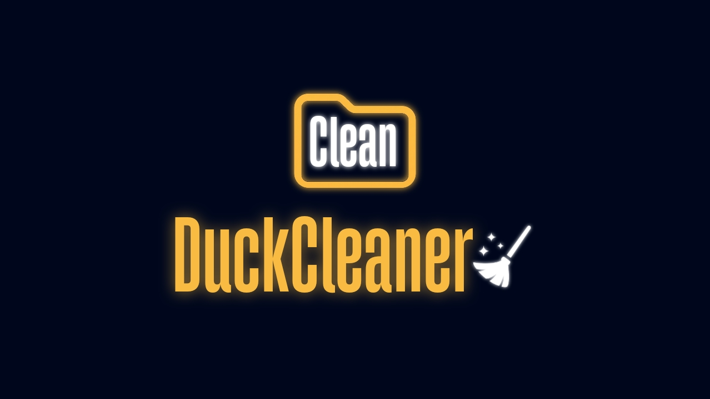

# Duck Cleaner

A tool that organizes messy project folders (code + assets all mixed together) into clean subfolders — and automatically fixes any file paths in your code so nothing breaks.

## The problem

If you just drag files into folders manually, you break every `import` or `open()` pointing to them. Duck Cleaner sorts everything by file type AND updates the references in your code, so the project still runs after.

## How to use it

1. Download this repo
2. Run `app.py`
3. Give it the path to the project folder you want cleaned up
4. It creates a new folder called `yourproject_clean` next to it, fully organized. Your original folder isn't touched.

## What it also handles

- If two files have the same name and would collide, it renames one instead of overwriting it
- Original project stays untouched, everything happens in a copy

Feedback/issues welcome, still early.
